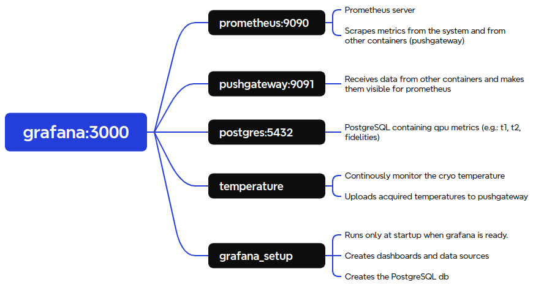

# dashboards

## Installation instruction

Docker containers can be set up (the optional flag `-d` can be added to run containers in the background) with
``` bash
docker compose up --build
```

Containers can be shut down with
``` bash
docker compose down
```

## Containers

Currently the following containers are created:
 - `grafana` with a Grafana server, exposing port `3000`.
 - `grafana_setup` containing scripts for automatic configuration of grafana.
 Starts running only after `grafana` is fully running. It stops immediately after.
 - `prometheus` containing a Prometheus server, exposing port `9090`.
 - `pushgateway` containing https://github.com/prometheus/pushgateway server, exposing port `9091`.
 It can be used for sending metrics, which will then be scraped by Prometheus.
 - `monitoring` containing a Ubuntu image with `qibocal` to be restarted at regular intervals for acquiring QPU metrics.



## Grafana users

By default grafana only creates an account with admin privileges with username `admin` and password `admin`.
Its password can be changed and other users may be created by setting environment variables in a `.env` file placed at the root of this repository.
A `.env` file will look like this:
``` bash
ADMIN_PASSWORD=new_admin_password
GRAFANA_USERS='[{"login":"first_user","password":"first_password"}, {"login":"second_user","password":"second_password","role":"Editor"}]'
```

## Monitoring QPUs

QPUs are monitored with the `qpu_monitoring` Python package.

``` bash
python -m qpu_monitoring
```

### Set up monitoring

The package can be installed using `poetry`:

``` bash
cd qpu_monitoring
poetry install
```

### Monitor QPUs on a slurm cluster

`qpu_monitoring` can also run on slurm clusters passing a json dictionary of the QPUs to be monitored:

``` bash
python -m qpu_monitoring --slurm_configuration '[{"partition":"slurm_partition_name","platform":"qibolab_platform_name"}]' --qibolab_platforms_path /path/to/qibolab/plaftorms
```

Note: the directory containing qibolab runcards needs to be specified using the `--qibolab_platforms_path` flag.
